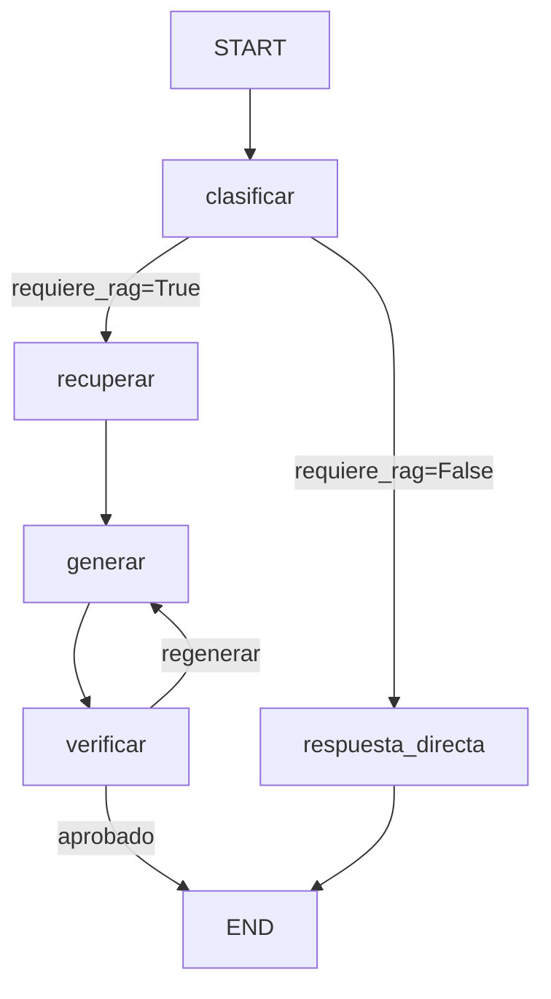

# Informe Técnico: Sistema RAG Biomédico
## Trabajo Práctico 1 — Ingeniería Ontológica (3010090)
**Universidad Nacional de Colombia — Sede Medellín**
**Profesor:** Jaime Alberto Guzmán Luna

---

## Tabla de Contenidos

1. [Introducción](#1-introducción)
2. [Dominio de Aplicación](#2-dominio-de-aplicación)
3. [Arquitectura General del Sistema](#3-arquitectura-general-del-sistema)
4. [Componente 1: Construcción del Corpus](#4-componente-1-construcción-del-corpus)
5. [Componente 2: Consumo e Indexación](#5-componente-2-consumo-e-indexación)
6. [Componente 3: Clasificación de Consultas](#6-componente-3-clasificación-de-consultas)
7. [Componente 4: Búsqueda Semántica](#7-componente-4-búsqueda-semántica)
8. [Componente 5: Generación de Respuesta](#8-componente-5-generación-de-respuesta)
9. [Componente 6: Verificación y Crítica](#9-componente-6-verificación-y-crítica)
10. [Componente 7: Trazabilidad](#10-componente-7-trazabilidad)
11. [Flujo LangGraph](#11-flujo-langgraph)
12. [Herramientas (Tools)](#12-herramientas-tools)
13. [Uso Diferenciado de LLMs](#13-uso-diferenciado-de-llms)
14. [Casos de Uso](#14-casos-de-uso)
15. [Stack Tecnológico](#15-stack-tecnológico)

---

## 1. Introducción

### ¿Qué es RAG?

**RAG (Retrieval-Augmented Generation)** es un paradigma de IA que combina dos
capacidades complementarias:

- **Recuperación** (*Retrieval*): búsqueda de información relevante en una base
  de conocimiento externa (en este caso, artículos científicos).
- **Generación** (*Generation*): producción de respuestas en lenguaje natural
  usando un Modelo de Lenguaje Grande (LLM).

La motivación central de RAG es resolver una limitación crítica de los LLMs puros:
las **alucinaciones**. Un LLM entrenado hasta cierta fecha no conoce documentos
privados ni información posterior a su corte de conocimiento. Al forzar al modelo a
basar su respuesta *exclusivamente* en fragmentos recuperados de una base documental
verificada, se reduce drásticamente la probabilidad de que invente información.

```
┌─────────────┐     consulta      ┌──────────────────┐
│   Usuario   │ ────────────────► │  Sistema RAG     │
└─────────────┘                   │                  │
       ▲                          │  1. Clasificar   │
       │ respuesta + citas        │  2. Recuperar    │
       └──────────────────────────│  3. Generar      │
                                  │  4. Verificar    │
                                  └──────────────────┘
                                         │ ▲
                                  búsqueda│ │fragmentos
                                         ▼ │
                                  ┌──────────────┐
                                  │ Base vectorial│
                                  │  FAISS       │
                                  │  50 papers   │
                                  └──────────────┘
```

### Objetivo del sistema

Diseñar e implementar un sistema RAG capaz de responder preguntas en lenguaje
natural sobre un corpus de artículos científicos biomédicos, mediante un flujo
estructurado con **LangChain** y **LangGraph**, integrando los modelos **Gemini**
y **Groq** de forma diferenciada según las necesidades de cada etapa.

---

## 2. Dominio de Aplicación

### Dominio seleccionado: Bioinformática y Medicina

El corpus está compuesto por **50 artículos científicos de arXiv** en el área de
bioinformática y medicina computacional. La búsqueda abarca los siguientes
subtemas:

- Predicción de estructura de proteínas con deep learning
- Diagnóstico médico mediante imágenes con redes neuronales
- Descubrimiento de fármacos asistido por ML
- Genómica y aprendizaje automático
- NLP aplicado a registros clínicos
- Interacciones proteína-proteína
- Secuenciación de ADN y ARN

### Justificación del dominio

La bioinformática es un campo con una producción científica enorme y en rápida
evolución. Esto lo convierte en un caso de uso ideal para RAG porque:

1. Los LLMs generales carecen de conocimiento de los avances más recientes.
2. Los documentos son técnicamente densos y requieren recuperación precisa.
3. Las preguntas pueden ser de búsqueda, resumen o comparación de enfoques.
4. La verificación de alucinaciones es crítica en contextos médicos.

### Fuente de los documentos

| Campo | Detalle |
|---|---|
| Fuente | [arXiv.org](https://arxiv.org) (acceso abierto) |
| Formato | PDF |
| Cantidad | 50 artículos |
| Consulta de búsqueda | `bioinformatics machine learning genomics medical diagnosis deep learning protein structure drug discovery` |
| Ordenamiento | Por relevancia semántica |

---

## 3. Arquitectura General del Sistema

El sistema se estructura como un **grafo de ejecución dirigido** implementado con
LangGraph. Cada nodo realiza una función específica y las transiciones entre nodos
son predefinidas (no autónomas).

```
                         ┌─────────────┐
                         │    START    │
                         └──────┬──────┘
                                │
                                ▼
                      ┌─────────────────────┐
                      │   [1] CLASIFICAR    │  ← Gemini
                      │  (intención query)  │
                      └─────────┬───────────┘
                                │
               ┌────────────────┴────────────────┐
               │ requiere_rag = True              │ requiere_rag = False
               ▼                                  ▼
    ┌─────────────────────┐           ┌─────────────────────────┐
    │   [2] RECUPERAR     │           │  [5] RESPUESTA DIRECTA  │  ← Groq
    │  k dinámico (Groq)  │           │   (sin acceso al corpus) │
    │  + búsqueda FAISS   │           └────────────┬────────────┘
    └─────────┬───────────┘                        │
              │                                    ▼
              ▼                                  [END]
    ┌─────────────────────┐
    │   [3] GENERAR       │  ← Gemini
    │  respuesta + citas  │◄──────────────┐
    └─────────┬───────────┘               │ regenerar (max. 3 intentos)
              │                           │
              ▼                           │
    ┌─────────────────────┐               │
    │   [4] VERIFICAR     │  ← Gemini     │
    │ grounding/coherencia│───────────────┘
    │   /completitud      │
    └─────────┬───────────┘
              │ aprobado
              ▼
            [END]
```

### Estado compartido (RAGState)

Todos los nodos leen y escriben sobre un único estado tipado:

| Campo | Tipo | Descripción |
|---|---|---|
| `query` | `str` | Consulta original del usuario |
| `tipo_consulta` | `str` | Categoría: búsqueda / resumen / comparación / general |
| `requiere_rag` | `bool` | Si debe acceder al corpus |
| `docs_recuperados` | `list` | Fragmentos serializados con metadatos |
| `contexto` | `str` | Texto formateado para el prompt de generación |
| `respuesta` | `str` | Respuesta generada en el intento actual |
| `verificacion` | `dict` | Resultado de la evaluación (puntuaciones, veredicto) |
| `intento` | `int` | Número de intento de generación (máximo 3) |
| `respuesta_final` | `str` | Respuesta aprobada por el verificador |
| `traza` | `dict` | Log de cada nodo: LLM usado, decisiones, métricas |

---

## 4. Componente 1: Construcción del Corpus

### Descripción

Esta etapa descarga los 50 artículos científicos de arXiv utilizando la
biblioteca `arxiv` de Python. Cada artículo se guarda como PDF en Google Drive
y sus metadatos se registran en un archivo `manifest.json`.

### Metadatos preservados por documento

```json
{
  "doc_id": "doc_01",
  "filename": "doc_01_2401.12345.pdf",
  "titulo": "Deep Learning for Protein Structure Prediction",
  "autores": ["Alice Smith", "Bob Jones", "Carol Wu"],
  "anio": 2024,
  "arxiv_id": "2401.12345",
  "categorias": ["q-bio.BM", "cs.LG"],
  "abstract": "We present a novel approach..."
}
```

### Función principal

```python
def descargar_corpus(consulta: str, n: int = 50,
                     directorio: str = CORPUS_DIR) -> list[dict]:
    """
    Descarga hasta n artículos de arXiv que coincidan con consulta.
    Guarda los PDFs en directorio y retorna lista de metadatos.
    """
```

### Diagrama de flujo

```
arXiv API
    │
    │  búsqueda por consulta (top-50 por relevancia)
    ▼
Para cada artículo:
    ├─ ¿PDF ya existe en Drive? → saltar
    └─ No existe → descargar PDF → guardar metadatos
    │
    ▼
manifest.json (50 entradas)
```

### Estructura de carpetas en Drive

```
/content/drive/MyDrive/RAG_BioMed/
├── corpus/
│   ├── doc_01_2401.12345.pdf
│   ├── doc_02_2402.67890.pdf
│   └── ... (50 archivos)
├── faiss_index/
│   ├── index.faiss
│   └── index.pkl
└── manifest.json
```

---

## 5. Componente 2: Consumo e Indexación

### Descripción

Esta etapa procesa los PDFs descargados y construye la base de conocimiento
vectorial. El proceso tiene tres pasos: carga, segmentación y generación de
embeddings.

### Paso 1: Carga de documentos

Se usa `PyMuPDFLoader` (LangChain) para extraer el texto de cada PDF página
por página. Cada página se convierte en un objeto `Document` de LangChain con
metadatos enriquecidos:

```python
document.metadata = {
    "doc_id"   : "doc_01",          # identificador único
    "titulo"   : "Deep Learning...", # título del paper
    "autores"  : "Smith A., Jones B.",
    "anio"     : 2024,
    "arxiv_id" : "2401.12345",
    "filename" : "doc_01_2401.12345.pdf",
    "page"     : 3,                  # número de página (base 0)
}
```

### Paso 2: Segmentación en chunks

Los documentos se dividen en fragmentos usando `RecursiveCharacterTextSplitter`:

| Parámetro | Valor | Razón |
|---|---|---|
| `chunk_size` | 1 000 caracteres | Equilibrio entre contexto y precisión |
| `chunk_overlap` | 200 caracteres | Evita cortar conceptos en el borde |
| `separators` | `["\n\n", "\n", ". ", " ", ""]` | Preserva párrafos y oraciones |

A cada chunk se le asigna un `chunk_id` único:

```
doc_01_chunk_001
doc_01_chunk_002
...
doc_50_chunk_N
```

Este identificador es esencial para la **trazabilidad de citas**: permite
saber exactamente qué fragmento del qué documento originó cada afirmación
en la respuesta final.

### Paso 3: Embeddings y construcción del índice

Los chunks se convierten en vectores numéricos usando el modelo de embeddings
**`text-embedding-004`** de Google:

```
texto (chunk)  →  [0.023, -0.418, 0.891, ...]  (vector de 768 dimensiones)
```

Todos los vectores se indexan en **FAISS** (Facebook AI Similarity Search),
una biblioteca optimizada para búsqueda de vecinos más cercanos en espacios
de alta dimensión.

### ¿Por qué FAISS?

- **Velocidad**: búsqueda en O(log n) con índices aproximados.
- **Sin servidor**: se ejecuta localmente, sin costo adicional de API.
- **Persistencia**: el índice se guarda en Drive y se reutiliza entre sesiones.
- **Escala**: maneja millones de vectores eficientemente.

### Resumen de la indexación

```
50 PDFs
   │
   │ PyMuPDFLoader (página por página)
   ▼
~5 000 páginas (Document objects con metadatos)
   │
   │ RecursiveCharacterTextSplitter (chunk_size=1000, overlap=200)
   ▼
~15 000 chunks (cada uno con doc_id + page + chunk_id)
   │
   │ GoogleGenerativeAIEmbeddings (text-embedding-004)
   ▼
~15 000 vectores de 768 dimensiones
   │
   │ FAISS.from_documents()
   ▼
Índice FAISS (guardado en Drive)
```

---

## 6. Componente 3: Clasificación de Consultas

### Descripción

Antes de cualquier búsqueda, el sistema identifica la **intención del usuario**
para enrutar la consulta por el camino correcto del grafo.

### Categorías de consulta

| Categoría | Descripción | ¿Requiere RAG? | Ejemplo |
|---|---|---|---|
| `búsqueda` | Solicita hechos o datos específicos del corpus | Sí | *"¿Qué datasets se usan para cáncer?"* |
| `resumen` | Pide resumir uno o varios documentos | Sí | *"Resume el paper doc_01"* |
| `comparación` | Quiere contrastar papers o enfoques | Sí | *"Compara doc_02 y doc_05"* |
| `general` | Pregunta de conocimiento general | No | *"¿Qué es el ADN?"* |

### LLM utilizado: Gemini 2.0 Flash

**Justificación**: La clasificación requiere comprensión contextual profunda y
razonamiento semántico para distinguir matices sutiles entre categorías. Por
ejemplo, *"dame información sobre proteínas"* es una búsqueda, mientras que
*"explícame qué son las proteínas"* es una consulta general. Gemini 2.0 Flash
supera a Groq en tareas de seguimiento de instrucciones complejas y razonamiento
semántico, siendo la opción óptima para este nodo.

### Salida estructurada (Pydantic)

```python
class ClasificacionConsulta(BaseModel):
    categoria: Literal['busqueda', 'resumen', 'comparacion', 'general']
    requiere_rag: bool
    doc_ids_mencionados: list[str]   # e.g. ["doc_01", "doc_03"]
    razonamiento: str                # explicación de la decisión
```

El uso de `PydanticOutputParser` garantiza que la salida del LLM sea siempre
un JSON válido y tipado, evitando errores en el flujo posterior.

### Flujo de clasificación

```
Consulta del usuario
      │
      │  Prompt + format_instructions
      ▼
Gemini 2.0 Flash (temperatura=0.0 para determinismo)
      │
      │  Texto JSON
      ▼
PydanticOutputParser
      │
      ▼
ClasificacionConsulta {categoria, requiere_rag, ...}
      │
      ▼
Enrutador condicional del grafo
```

---

## 7. Componente 4: Búsqueda Semántica

### Descripción

Cuando la consulta requiere RAG, este componente recupera los fragmentos más
relevantes del índice FAISS. Opera en dos sub-pasos:

### Sub-paso 1: Selección dinámica de k (Groq)

En lugar de usar un valor fijo de documentos a recuperar, el sistema pregunta a
un LLM cuántos fragmentos son necesarios según la complejidad de la consulta:

```
Tipo: "comparación"
Consulta: "Compara doc_02 y doc_05 en metodología"
→ Groq decide: k = 8  (necesita varios fragmentos de cada documento)

Tipo: "búsqueda"
Consulta: "¿Qué es BERT?"
→ Groq decide: k = 3  (pregunta puntual, pocos fragmentos bastan)
```

**Rango permitido:** k ∈ [3, 15]

**LLM utilizado: Groq LLaMA 3.3 70B**
**Justificación**: La selección de k es una **micro-decisión** que no requiere
razonamiento profundo, solo evaluar la complejidad de la consulta y retornar un
número. Groq con LLaMA 3.3 70B ofrece latencias menores a 500 ms, reduciendo
el overhead de esta decisión al mínimo sin sacrificar calidad.

### Sub-paso 2: Búsqueda semántica en FAISS

```python
docs_scores = vs.similarity_search_with_score(query, k=k)
```

FAISS calcula la **similitud coseno** entre el vector de la consulta y todos los
vectores del índice, retornando los k fragmentos más cercanos en el espacio
semántico junto con su puntuación de similitud.

### Metadatos preservados en la recuperación

Cada fragmento recuperado incluye:

```python
{
    "contenido": "texto del fragmento...",
    "metadata": {
        "doc_id"          : "doc_07",
        "titulo"          : "Drug Discovery with GNNs",
        "autores"         : "Li X., Zhang Y.",
        "pagina"          : 5,
        "chunk_id"        : "doc_07_chunk_023",
        "similarity_score": 0.8741
    }
}
```

Estos metadatos viajan intactos hasta la respuesta final, habilitando las citas.

---

## 8. Componente 5: Generación de Respuesta

### Descripción

Con los fragmentos recuperados, este componente construye el prompt y genera
una respuesta coherente que incluye citas numeradas.

### LLM utilizado: Gemini 2.0 Flash

**Justificación**: La generación de respuestas largas y coherentes es la tarea
más exigente del pipeline. Requiere:
- Sintetizar múltiples fragmentos sin contradecirse.
- Seguir instrucciones complejas de formato (citas `[1]`, `[2]`, etc.).
- Manejar contextos largos (hasta 6 000 caracteres de fragmentos).
- Producir texto académico fluido y preciso.

Gemini 2.0 Flash supera a Groq en todas estas dimensiones para generación de
texto técnico extenso.

### Construcción del contexto

Antes de enviarse al LLM, los fragmentos se formatean como un bloque de contexto
etiquetado:

```
--- Fragmento 1 ---
[1] Drug Discovery with GNNs | doc_07 p.5 | chunk=doc_07_chunk_023
Graph neural networks (GNNs) have emerged as a powerful tool for
predicting molecular interactions...

--- Fragmento 2 ---
[2] Deep Learning in Genomics | doc_12 p.3 | chunk=doc_12_chunk_011
Convolutional neural networks applied to genomic sequences enable...
```

### Prompt de generación

```
System:
  Eres un experto en bioinformática basado en 50 papers de arXiv.
  INSTRUCCIONES:
  1. Responde ÚNICAMENTE con información del contexto.
  2. Incluye citas [1], [2], etc. al referenciar fragmentos.
  3. Si no está en el contexto: "No encontrado en el corpus".
  4. Tono académico y preciso.
  CONTEXTO: {fragmentos_formateados}
```

### Ejemplo de respuesta generada

```
El deep learning ha transformado el diagnóstico médico por imágenes.
Las redes neuronales convolucionales (CNN) son el enfoque dominante para
clasificación de radiografías y tomografías [1][3]. En particular, las
arquitecturas ResNet y DenseNet han logrado precisiones superiores al 95%
en detección de nódulos pulmonares [2]. Modelos más recientes basados en
transformadores (Vision Transformers) superan a las CNN en datasets grandes [4].

Referencias:
[1] doc_07 | p.5 | chunk=doc_07_chunk_023
[2] doc_12 | p.3 | chunk=doc_12_chunk_011
[3] doc_19 | p.7 | chunk=doc_19_chunk_044
[4] doc_31 | p.2 | chunk=doc_31_chunk_008
```

---

## 9. Componente 6: Verificación y Crítica

### Descripción

El agente verificador evalúa automáticamente la calidad de la respuesta generada
antes de entregarla al usuario. Si la respuesta no supera los criterios, el sistema
entra en un **loop controlado** de regeneración (máximo 3 intentos).

### LLM utilizado: Gemini 2.0 Flash

**Justificación**: La verificación es la tarea más exigente del pipeline porque
requiere:
- **Razonamiento multi-criterio**: evaluar simultáneamente grounding, coherencia
  y completitud.
- **Detección de alucinaciones**: identificar afirmaciones no respaldadas por el
  contexto, incluyendo variantes sutiles (datos correctos pero atribuidos al
  paper incorrecto).
- **Evaluación de completitud**: determinar si la pregunta fue respondida en
  todos sus aspectos.

Gemini supera a Groq en estas tareas de razonamiento crítico complejo.

### Criterios de evaluación

| Criterio | Descripción | Umbral mínimo |
|---|---|---|
| **Grounding** | Fracción de afirmaciones respaldadas por el contexto recuperado | 0.70 |
| **Coherencia** | Ausencia de contradicciones internas y datos inventados | 0.70 |
| **Completitud** | Grado en que se responde completamente la pregunta original | 0.70 |

**Regla de aprobación:** `aprobado = True` si y solo si los **tres** criterios ≥ 0.70.

### Salida estructurada (Pydantic)

```python
class ResultadoVerificacion(BaseModel):
    aprobado               : bool
    puntuacion_grounding   : float  # [0.0, 1.0]
    puntuacion_coherencia  : float  # [0.0, 1.0]
    puntuacion_completitud : float  # [0.0, 1.0]
    problemas              : list[str]   # lista de issues detectados
    sugerencias            : str         # instrucciones para mejorar
```

### Loop de regeneración controlado

```
Respuesta generada (intento 1)
        │
        ▼
  [VERIFICAR]  ──── aprobado ────► retornar respuesta
        │
        │ no aprobado + intento < 3
        ▼
  [GENERAR] (intento 2, con sugerencias del verificador)
        │
        ▼
  [VERIFICAR]  ──── aprobado ────► retornar respuesta
        │
        │ no aprobado + intento < 3
        ▼
  [GENERAR] (intento 3, último intento)
        │
        ▼
  [VERIFICAR]  ──── aprobado ────► retornar respuesta
        │
        │ no aprobado + intento = 3
        ▼
  retornar mejor respuesta disponible (forzar salida)
```

Las **sugerencias** del verificador se pasan al nodo de generación para guiar
la mejora, creando un ciclo de retroalimentación controlado.

---

## 10. Componente 7: Trazabilidad

### Descripción

El sistema registra en el campo `traza` del estado toda la información sobre
cómo se produjo cada respuesta. Esta información se presenta al usuario al
final de cada ejecución.

### Información registrada por nodo

#### Nodo clasificar
```json
{
  "clasificacion": {
    "categoria"    : "búsqueda",
    "requiere_rag" : true,
    "razonamiento" : "El usuario solicita datos específicos sobre métodos...",
    "llm"          : "gemini-2.0-flash"
  }
}
```

#### Nodo recuperar
```json
{
  "recuperacion": {
    "k_dinamico": 6,
    "num_docs"  : 6,
    "docs"      : [
      "doc_07 (score=0.8741)",
      "doc_12 (score=0.8523)",
      "doc_19 (score=0.8341)"
    ],
    "llm_k"     : "llama-3.3-70b-versatile"
  }
}
```

#### Nodo generar
```json
{
  "generacion": {
    "intento"        : 1,
    "llm"            : "gemini-2.0-flash",
    "longitud"       : 847,
    "con_sugerencias": false
  }
}
```

#### Nodo verificar
```json
{
  "verificacion": {
    "aprobado"    : true,
    "grounding"   : 0.92,
    "coherencia"  : 0.88,
    "completitud" : 0.85,
    "problemas"   : [],
    "sugerencias" : "",
    "llm"         : "gemini-2.0-flash"
  }
}
```

### Salida de trazabilidad en consola

```
═══════════════════════════════════════════════════════════════
TRAZABILIDAD
═══════════════════════════════════════════════════════════════

  [CLASIFICACION]
    categoria          : búsqueda
    requiere_rag       : True
    razonamiento       : El usuario solicita datos específicos...
    llm                : gemini-2.0-flash

  [RECUPERACION]
    k_dinamico         : 6
    num_docs           : 6
    docs               : ['doc_07 (score=0.8741)', 'doc_12 (score=0.8523)']
    llm_k              : llama-3.3-70b-versatile

  [GENERACION]
    intento            : 1
    llm                : gemini-2.0-flash
    longitud           : 847

  [VERIFICACION]
    aprobado           : True
    grounding          : 0.92
    coherencia         : 0.88
    completitud        : 0.85

═══════════════════════════════════════════════════════════════
DOCUMENTOS RECUPERADOS
═══════════════════════════════════════════════════════════════
  doc_07 | p.5 | score=0.8741  Drug Discovery with Graph Neural Networks
  doc_12 | p.3 | score=0.8523  Deep Learning for Medical Diagnosis

═══════════════════════════════════════════════════════════════
RESPUESTA FINAL
═══════════════════════════════════════════════════════════════
[respuesta generada con citas]
```

---

## 11. Flujo LangGraph

### ¿Qué es LangGraph?

LangGraph es una extensión de LangChain que permite modelar flujos de
procesamiento como **grafos dirigidos**. Cada nodo es una función que transforma
el estado, y las aristas definen las transiciones entre nodos.

La diferencia clave respecto a un agente LLM autónomo es que en LangGraph las
**transiciones son predefinidas por el programador**, no decididas libremente
por el LLM en cada paso. Esto hace el sistema más predecible, auditable y robusto.

### Definición del grafo

```python
wf = StateGraph(RAGState)

# Registrar nodos
wf.add_node('clasificar',        nodo_clasificar)
wf.add_node('recuperar',         nodo_recuperar)
wf.add_node('generar',           nodo_generar)
wf.add_node('verificar',         nodo_verificar)
wf.add_node('respuesta_directa', nodo_respuesta_directa)

# Aristas fijas (siempre se ejecutan)
wf.add_edge(START,       'clasificar')
wf.add_edge('recuperar', 'generar')
wf.add_edge('generar',   'verificar')
wf.add_edge('respuesta_directa', END)

# Aristas condicionales (dependen del estado)
wf.add_conditional_edges('clasificar', enrutar_clasificacion,
    {'recuperar': 'recuperar', 'respuesta_directa': 'respuesta_directa'})

wf.add_conditional_edges('verificar', enrutar_verificacion,
    {'aprobado': END, 'regenerar': 'generar'})

app = wf.compile()
```

### Funciones enrutadoras

```python
def enrutar_clasificacion(state: RAGState) -> str:
    """Dirige a recuperación o respuesta directa según requiere_rag."""
    return 'recuperar' if state['requiere_rag'] else 'respuesta_directa'

def enrutar_verificacion(state: RAGState) -> str:
    """Aprueba la respuesta o solicita regeneración (máx. 3 intentos)."""
    if state['verificacion']['aprobado']:
        return 'aprobado'
    if state.get('intento', 1) >= MAX_REINTENTOS:
        return 'aprobado'   # forzar salida
    state['intento'] += 1
    return 'regenerar'
```

### Representación Mermaid del grafo



---

## 12. Herramientas (Tools)

El sistema implementa **6 herramientas** LangChain que encapsulan las operaciones
atómicas del RAG y pueden ser invocadas de forma directa o integradas en agentes.

### Tool 1: `buscar_documentos`

```python
@tool
def buscar_documentos(query: str, k: int = 5) -> str:
    """
    Búsqueda semántica en el corpus biomédico (50 papers de arXiv).
    Retorna los fragmentos más relevantes con metadatos completos.
    """
```

**Funcionamiento:** Convierte `query` en un vector de embeddings y busca los
`k` fragmentos más similares en el índice FAISS. Retorna JSON con contenido y
metadatos de cada fragmento.

**Uso típico:** Responder preguntas de tipo `búsqueda`.

---

### Tool 2: `resumir_documento`

```python
@tool
def resumir_documento(doc_id: str) -> str:
    """
    Resume el contenido de un paper específico dado su doc_id.
    Usa Gemini para sintetizar los fragmentos más representativos.
    """
```

**Funcionamiento:** Recupera los fragmentos más representativos del documento
`doc_id` y los pasa a Gemini para generar un resumen de ~250 palabras.

**Uso típico:** Responder consultas de tipo `resumen` de un documento específico.

---

### Tool 3: `comparar_documentos`

```python
@tool
def comparar_documentos(doc_ids: str, aspecto: str = 'metodología') -> str:
    """
    Compara dos o más papers del corpus según un aspecto específico.
    doc_ids: IDs separados por coma (e.g. 'doc_01,doc_03').
    """
```

**Funcionamiento:** Para cada `doc_id`, recupera los fragmentos más relevantes
respecto al `aspecto` dado. Luego Gemini sintetiza una comparación estructurada.

**Uso típico:** Responder consultas de tipo `comparación`.

---

### Tool 4: `listar_documentos`

```python
@tool
def listar_documentos(anio: int = 0) -> str:
    """
    Lista todos los papers disponibles en el corpus.
    Filtra por año de publicación si anio > 0.
    """
```

**Funcionamiento:** Lee el `manifest.json` y retorna el catálogo completo o
filtrado por año. Útil para orientar al usuario sobre qué documentos existen.

---

### Tool 5: `buscar_por_autor`

```python
@tool
def buscar_por_autor(nombre: str) -> str:
    """
    Busca papers del corpus cuyos autores contengan `nombre`.
    Búsqueda parcial, no sensible a mayúsculas.
    """
```

**Funcionamiento:** Filtra el `manifest.json` buscando `nombre` en el campo
`autores` de cada documento. Soporta búsqueda parcial (e.g., "Li" encuentra
"Xiao Li", "Li Zhang", etc.).

---

### Tool 6: `obtener_metadata`

```python
@tool
def obtener_metadata(doc_id: str) -> str:
    """
    Retorna metadatos completos de un paper: título, autores, año,
    arxiv_id y abstract.
    """
```

**Funcionamiento:** Consulta el índice `manifest_idx` (diccionario en memoria)
y retorna los metadatos del documento en formato JSON. Útil para inspección
directa de papers.

---

## 13. Uso Diferenciado de LLMs

### Resumen de asignaciones

| Nodo / Tarea | LLM | Modelo |
|---|---|---|
| Clasificación de consultas | **Gemini** | `gemini-2.0-flash` |
| k dinámico en recuperación | **Groq** | `llama-3.3-70b-versatile` |
| Generación de respuesta | **Gemini** | `gemini-2.0-flash` |
| Verificación / Crítica | **Gemini** | `gemini-2.0-flash` |
| Consultas generales (sin RAG) | **Groq** | `llama-3.3-70b-versatile` |

### Justificación detallada

#### ¿Cuándo usar Gemini?

Gemini 2.0 Flash es la opción óptima cuando la tarea requiere:

1. **Comprensión contextual profunda**: analizar el significado implícito de una
   consulta, distinguir intenciones sutiles entre categorías.
2. **Generación de texto largo y coherente**: sintetizar múltiples fuentes en
   una respuesta fluida con formato complejo (citas numeradas, párrafos).
3. **Razonamiento multi-criterio**: evaluar simultáneamente varios aspectos de
   calidad (grounding + coherencia + completitud).
4. **Seguimiento de instrucciones complejas**: formatos de salida estructurada
   con múltiples restricciones.

**Tareas asignadas:** Clasificación, Generación, Verificación.

#### ¿Cuándo usar Groq?

Groq con LLaMA 3.3 70B es la opción óptima cuando la tarea requiere:

1. **Latencia mínima**: Groq tiene un hardware especializado (LPU) que ofrece
   inferencia en <500 ms, ideal para micro-decisiones que no deben frenar el flujo.
2. **Decisiones simples y directas**: seleccionar un número (k), responder
   preguntas generales sin contexto complejo.
3. **Ahorro de costos**: no desperdiciar capacidad de Gemini en tareas simples.

**Tareas asignadas:** Selección dinámica de k, Respuestas generales.

### Comparación de características

| Característica | Gemini 2.0 Flash | Groq LLaMA 3.3 70B |
|---|---|---|
| Latencia promedio | ~1-2 s | <0.5 s |
| Tamaño de contexto | 1M tokens | 128K tokens |
| Calidad en razonamiento complejo | ★★★★★ | ★★★★☆ |
| Velocidad de generación | ★★★★☆ | ★★★★★ |
| Seguimiento de instrucciones | ★★★★★ | ★★★★☆ |
| Costo por token | Bajo | Muy bajo |

---

## 14. Casos de Uso

El sistema contempla los siguientes 10 casos de uso para la demostración:

| ID | Consulta | Tipo | Flujo |
|---|---|---|---|
| CU-01 | ¿Qué métodos de deep learning se usan para predecir la estructura de proteínas? | búsqueda | RAG completo |
| CU-02 | ¿Cuáles son los principales datasets usados para diagnóstico de cáncer con ML? | búsqueda | RAG completo |
| CU-03 | ¿Cómo se aplican las CNN al análisis de imágenes médicas? | búsqueda | RAG completo |
| CU-04 | ¿Qué técnicas de NLP se usan para extraer información de registros clínicos? | búsqueda | RAG completo |
| CU-05 | Resume el paper doc_01 | resumen | RAG completo |
| CU-06 | Dame un resumen de los papers del corpus sobre drug discovery | resumen | RAG completo |
| CU-07 | Compara los enfoques de doc_02 y doc_04 en términos de metodología y resultados | comparación | RAG completo |
| CU-08 | ¿Qué es el aprendizaje por transferencia (transfer learning)? | general | Respuesta directa (Groq) |
| CU-09 | ¿Qué modelos de lenguaje se han aplicado a secuencias genómicas? | búsqueda | RAG completo |
| CU-10 | Lista los papers del corpus | búsqueda | Tool directa |

### Flujo detallado para CU-01 (búsqueda)

```
Usuario: "¿Qué métodos de deep learning se usan para predecir estructura de proteínas?"
    │
    ▼
[CLASIFICAR] → Gemini
    • categoria    : búsqueda
    • requiere_rag : True
    • razonamiento : "Pregunta sobre métodos específicos en el corpus"
    │
    ▼
[RECUPERAR] → Groq (k=5) + FAISS
    • k dinámico  : 5
    • docs        : doc_03 (0.92), doc_07 (0.89), doc_15 (0.87), ...
    │
    ▼
[GENERAR] → Gemini
    • respuesta con citas [1]-[5]
    • longitud   : ~600 palabras
    │
    ▼
[VERIFICAR] → Gemini
    • grounding   : 0.91  ✓
    • coherencia  : 0.88  ✓
    • completitud : 0.85  ✓
    • aprobado    : True
    │
    ▼
Respuesta final + trazabilidad completa
```

### Flujo detallado para CU-08 (consulta general)

```
Usuario: "¿Qué es el aprendizaje por transferencia?"
    │
    ▼
[CLASIFICAR] → Gemini
    • categoria    : general
    • requiere_rag : False
    • razonamiento : "Concepto de conocimiento general, no requiere corpus"
    │
    ▼
[RESPUESTA DIRECTA] → Groq
    • respuesta rápida (<500 ms) sin acceder al corpus
    │
    ▼
Respuesta final + trazabilidad
```

---

## 15. Stack Tecnológico

### Dependencias principales

| Paquete | Versión | Rol |
|---|---|---|
| `langchain` | 0.3.14 | Framework base (cadenas, prompts, parsers) |
| `langchain-community` | 0.3.14 | Integraciones (PyMuPDFLoader, FAISS) |
| `langchain-google-genai` | 2.0.8 | Integración con Gemini y embeddings |
| `langchain-groq` | 0.2.3 | Integración con Groq Cloud |
| `langgraph` | 0.2.70 | Motor de grafo de ejecución |
| `faiss-cpu` | 1.9.0 | Base vectorial local |
| `pymupdf` | 1.25.2 | Extracción de texto de PDFs |
| `pydantic` | 2.10.4 | Validación y salida estructurada |
| `arxiv` | 2.1.3 | Descarga de papers de arXiv |

### Arquitectura de servicios

```
Google Colab (entorno de ejecución)
    │
    ├── Google Drive (almacenamiento)
    │   ├── corpus/ (50 PDFs)
    │   ├── faiss_index/ (vectores)
    │   └── manifest.json (metadatos)
    │
    ├── Google AI Studio API (Gemini + Embeddings)
    │   ├── gemini-2.0-flash
    │   └── text-embedding-004
    │
    └── Groq Cloud API (LLaMA)
        └── llama-3.3-70b-versatile
```

### Parámetros del sistema

| Parámetro | Valor |
|---|---|
| Tamaño del corpus | 50 documentos PDF |
| Chunk size | 1 000 caracteres |
| Chunk overlap | 200 caracteres |
| Dimensión de embeddings | 768 |
| k mínimo de recuperación | 3 |
| k máximo de recuperación | 15 |
| Umbral de verificación | 0.70 (todos los criterios) |
| Máximo de reintentos | 3 |
| Temperatura Gemini (generación) | 0.2 |
| Temperatura Gemini (clasificación/verificación) | 0.0 |
| Temperatura Groq | 0.0 |

---

*Documento generado para el Trabajo Práctico 1 — Sistema RAG Básico.*
*Universidad Nacional de Colombia, Sede Medellín — Ingeniería Ontológica 3010090.*